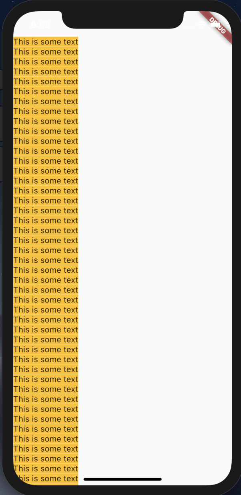

# SafeArea

## Docs

[SafeArea class](https://api.flutter.dev/flutter/widgets/SafeArea-class.html)

## ScreenShots

|[Without SafeArea](lib/pages/without_safe_area.dart)|[With SafeArea](lib/pages/safe_area.dart)|
|:-:|:-:|
|||

WithoutSafeArea_landscape  

WithSafeArea_landscape  

