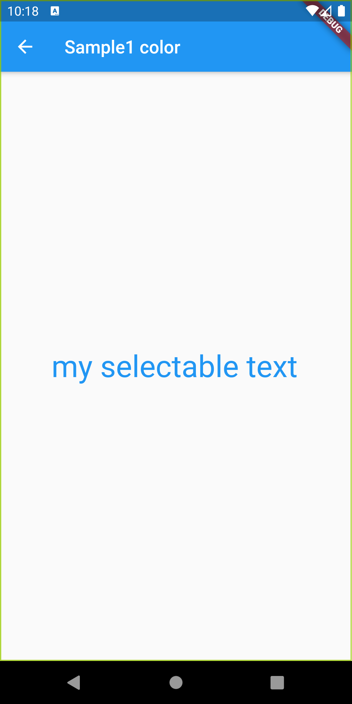
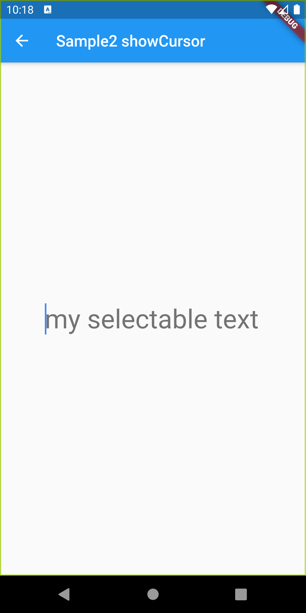
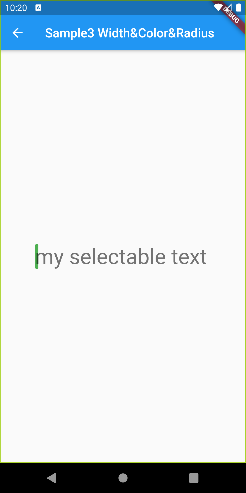
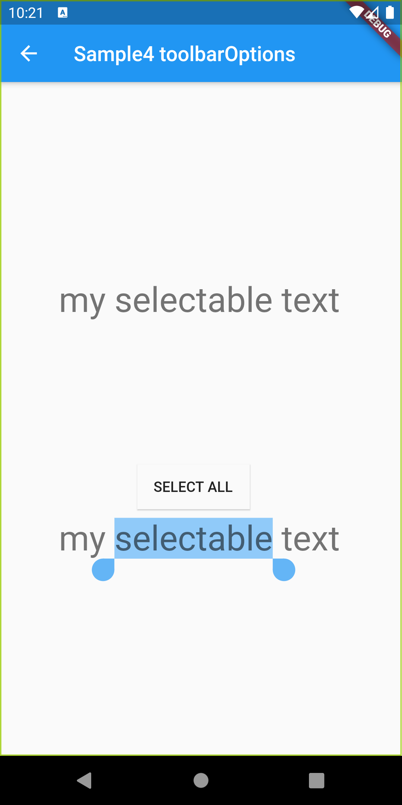
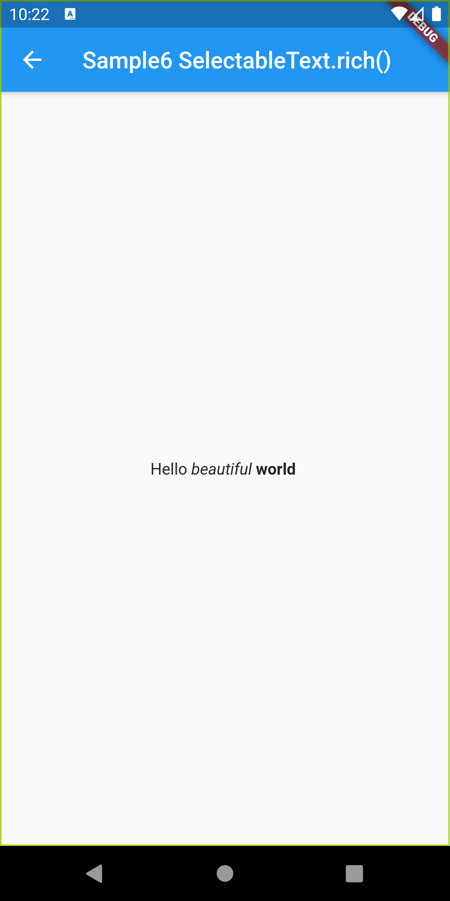

# SelectableText

## Docs

[SelectableText class](https://master-api.flutter.dev/flutter/material/SelectableText-class.html)

## Screenshots

|Sample1|Sample2|Sample3|
|:-:|:-:|:-:|
||||

|Sample4|Sample5|Sample6|
|:-:|:-:|:-:|
||||