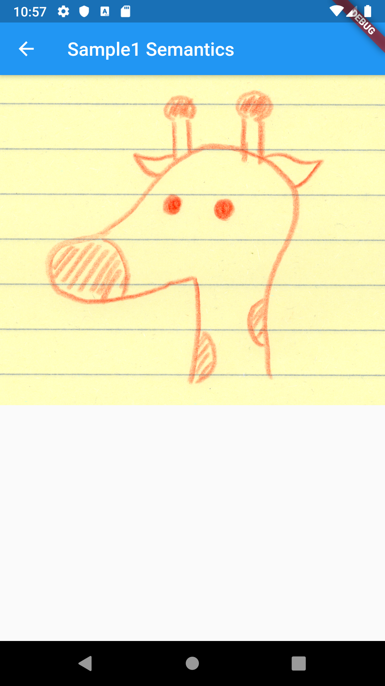
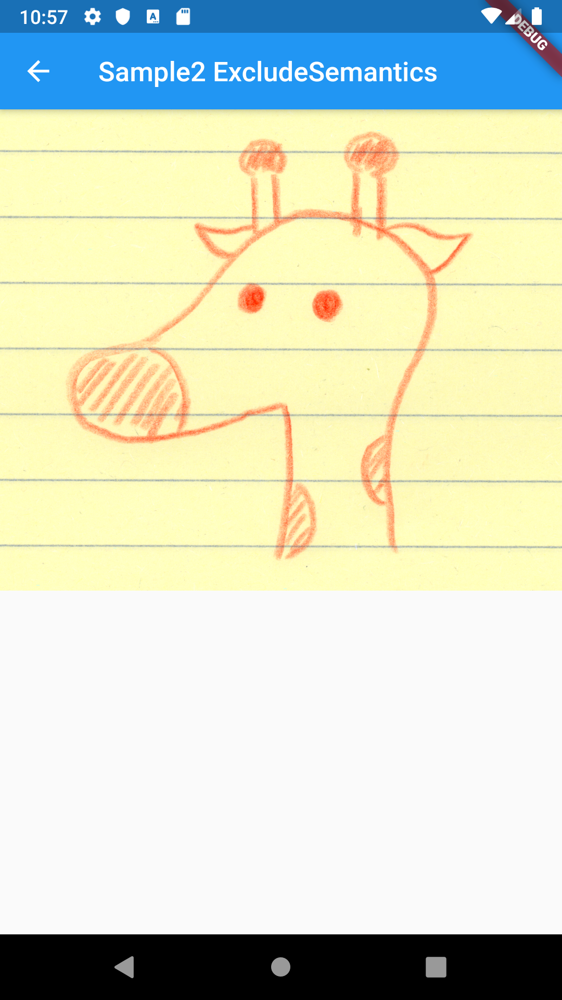
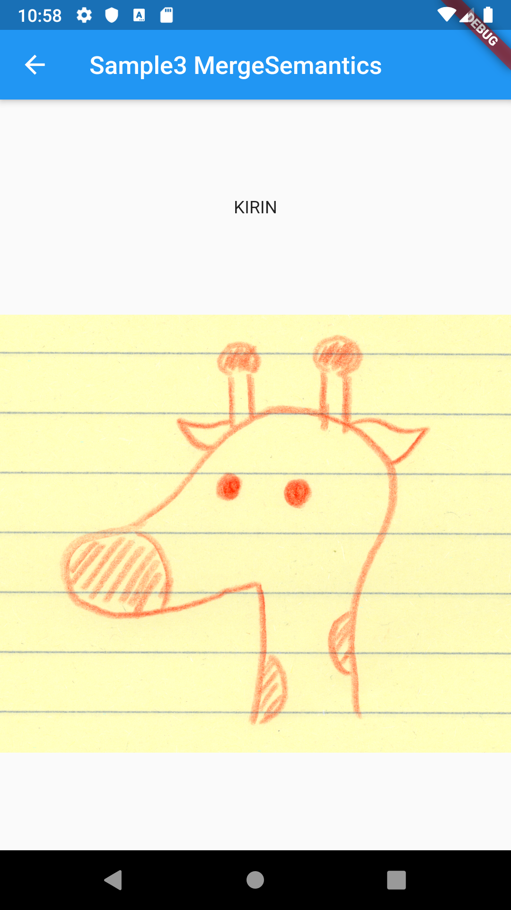
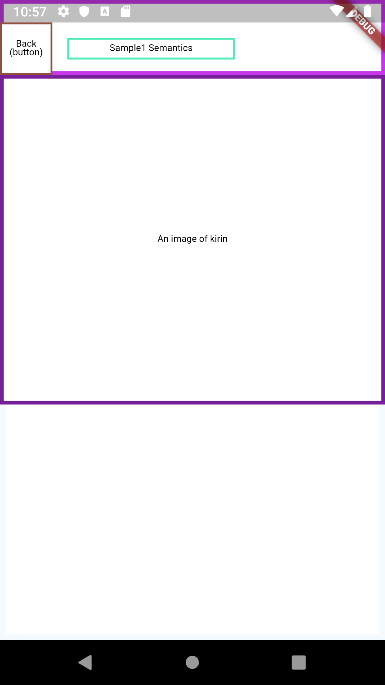
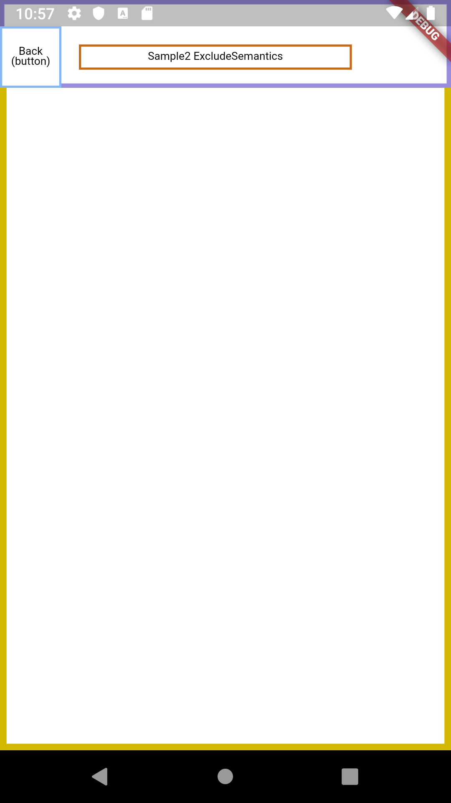
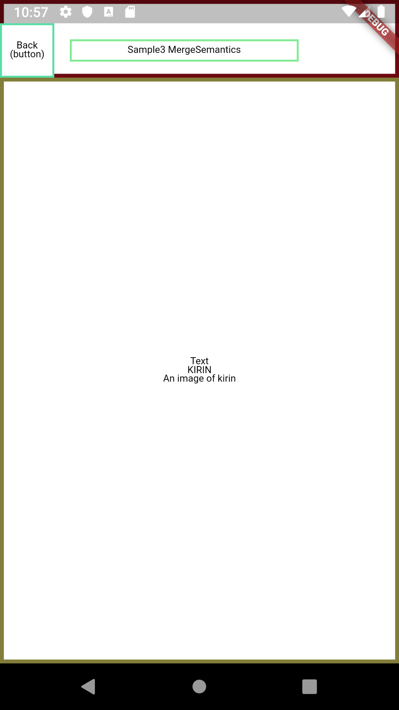

# Semantics

## Docs

[Semantics class](https://api.flutter.dev/flutter/widgets/Semantics-class.html)

[ExcludeSemantics class](https://api.flutter.dev/flutter/widgets/ExcludeSemantics-class.html)

[MergeSemantics class](https://api.flutter.dev/flutter/widgets/MergeSemantics-class.html)

## Screenshots

|Sample1 Semantics|Sample2 ExcludeSemantics|Sample3 MergeSemantics|
|:-:|:-:|:-:|
||||
||||

## How to show Semantics

Set showSemanticsDebugger property in MaterialApp to **true**.

```dart
class MyApp extends StatelessWidget {
  @override
  Widget build(BuildContext context) {
    return MaterialApp(
      showSemanticsDebugger: true,
      ...
```
