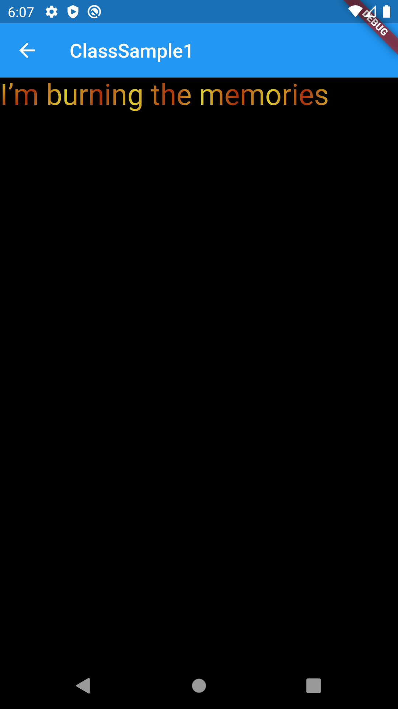

# ShaderMask

## Docs

[ShaderMask class](https://api.flutter.dev/flutter/widgets/ShaderMask-class.html)

[Understanding Flutter's ShaderMask | stackoverflow](https://stackoverflow.com/questions/57454851/understanding-flutters-shadermask)

[How to draw the Shape of Text? | stackoverflow](https://stackoverflow.com/questions/58237174/how-to-draw-the-shape-of-text)

[BlendModeについて | Qiita](https://qiita.com/ko2ic/items/77521e4344f3bd73d326)

## Screenshots

|[Sample1](./lib/pages/sample1.dart)|[ClassSample1](./lib/pages/class_sample1.dart)|
|:-:|:-:|
|||
