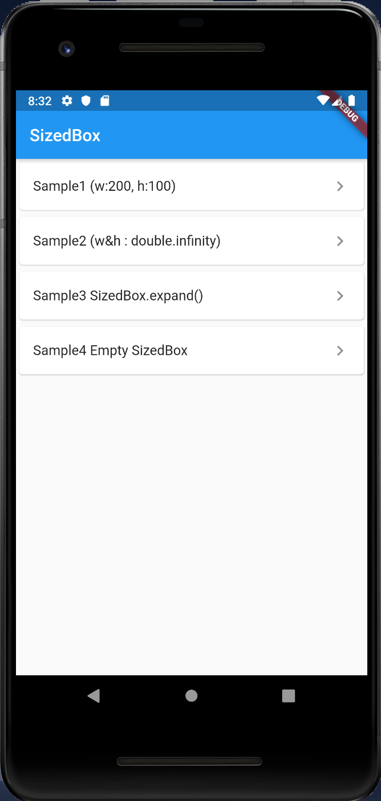
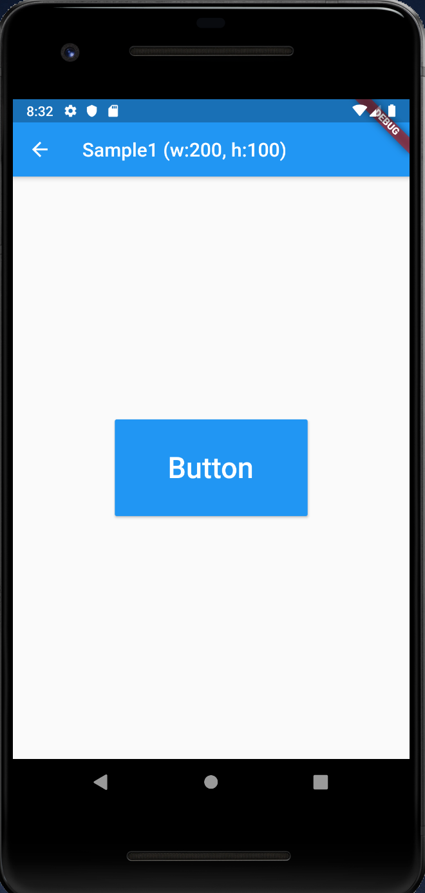
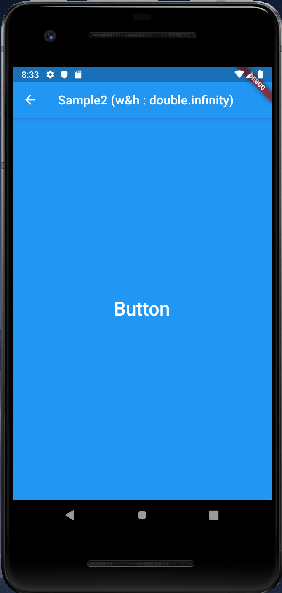
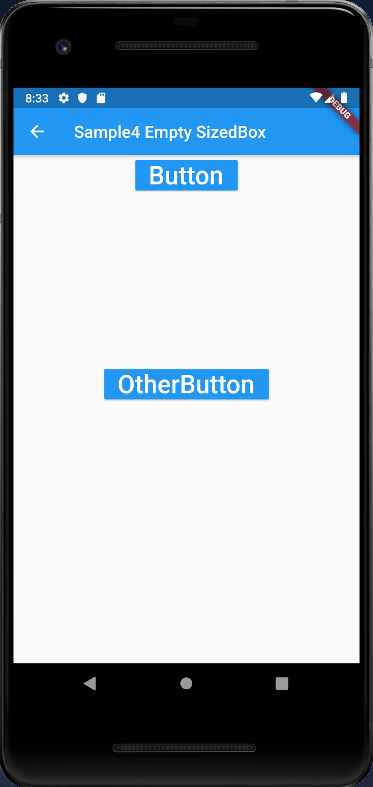

# SizedBox

## Docs

[SizedBox class](https://api.flutter.dev/flutter/widgets/SizedBox-class.html)

## Screenshots

|Menu|Sample1 (w:200, h:100)|Sample2 (w&h : double.infinity)|
|:-:|:-:|:-:|
||||

|Sample3 SizedBox.expand()|Sample4 Empty SizedBox|
|:-:|:-:|
|||
