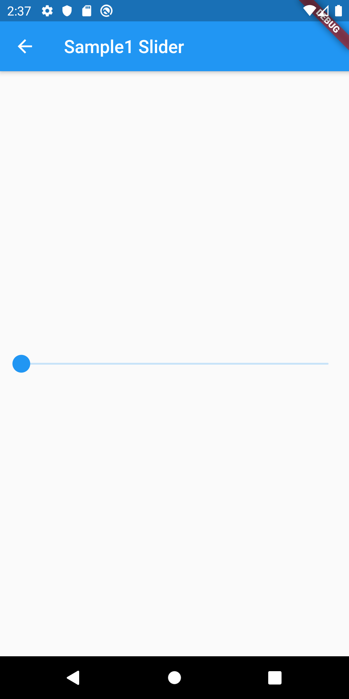
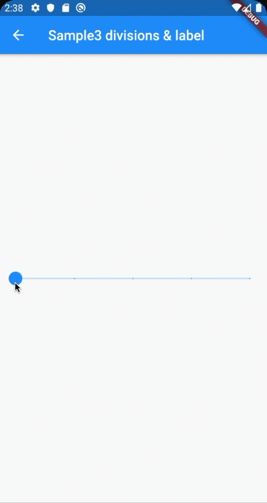
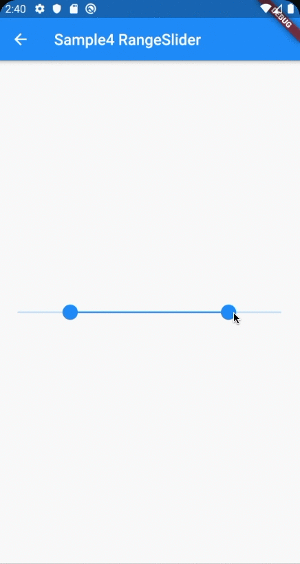
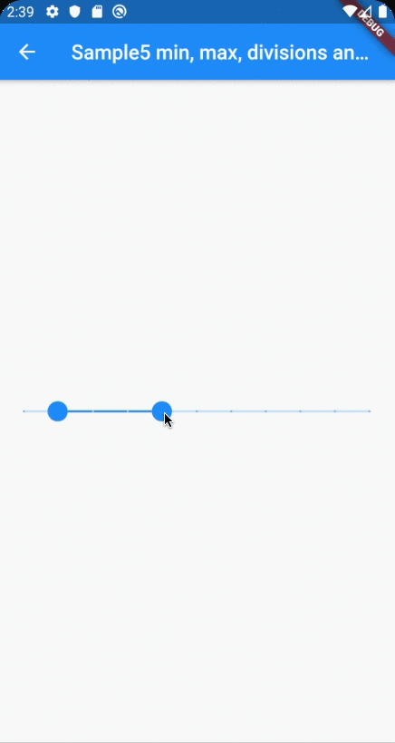

# Slider RangeSlider CupertinoSlider

## Docs

[Slider class](https://api.flutter.dev/flutter/material/Slider-class.html)

[CupertinoSlider class](https://api.flutter.dev/flutter/cupertino/CupertinoSlider-class.html)

[RangeSlider class](https://api.flutter.dev/flutter/material/RangeSlider-class.html)

## Screenshots

|[Sample1](./lib/pages/sample1.dart)|[Sample2](./lib/pages/sample2.dart)|[Sample3](./lib/pages/sample3.dart)|
|:-:|:-:|:-:|
||||

|[Sample4](./lib/pages/sample4.dart)|[Sample5](./lib/pages/sample5.dart)|[Sample6](./lib/pages/sample6.dart)|
|:-:|:-:|:-:|
||||

|[Sample7](./lib/pages/sample7.dart)|
|:-:|
||
