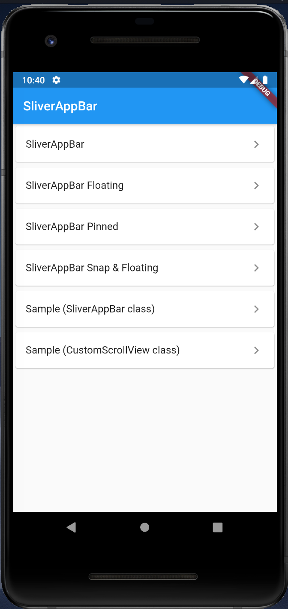

# SliverAppBar

## Docs

[SliverAppBar class](https://api.flutter.dev/flutter/material/SliverAppBar-class.html)

[CustomScrollView class](https://api.flutter.dev/flutter/widgets/CustomScrollView-class.html)

## Screenshots

|Menu|SliverAppBar|
|-|-|
|||

|Floating|Pinned|Snap & Floating|
|-|-|-|
||||

|Sample (SliverAppBar class)|Sample (CustomScrollView)|
|-|-|
|||
