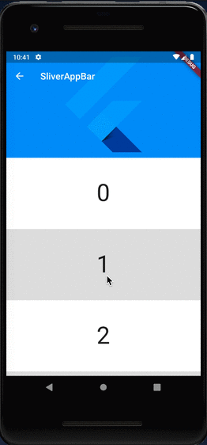
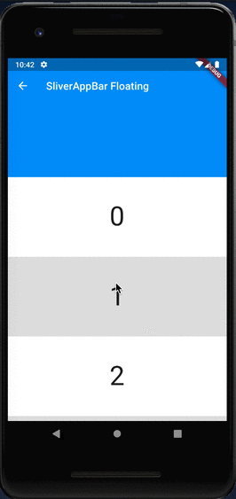
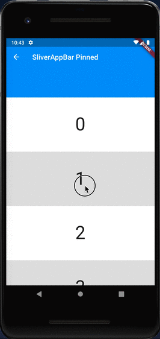
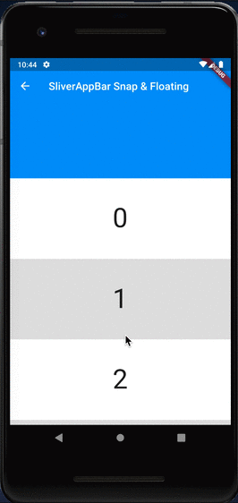
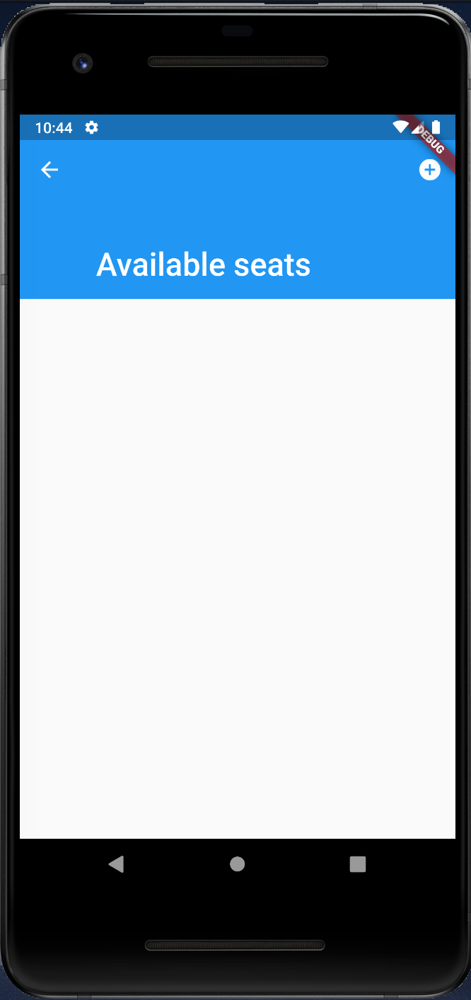
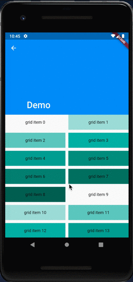

# SliverAppBar

## Docs

[SliverAppBar class](https://api.flutter.dev/flutter/material/SliverAppBar-class.html)

[CustomScrollView class](https://api.flutter.dev/flutter/widgets/CustomScrollView-class.html)

## Screenshots

|[SliverAppBar](lib/pages/sliver_app_bar.dart)|
|:-:|
||

|[Floating](lib/pages/sliver_app_bar_floating.dart)|[Pinned](lib/pages/sliver_app_bar_pinned.dart)|[Snap & Floating](lib/pages/sliver_app_bar_snap.dart)|
|:-:|:-:|:-:|
||||

|[Sample (SliverAppBar class)](lib/pages/sliver_app_bar_class_sample1.dart)|[Sample (CustomScrollView)](lib/pages/custom_scroll_view_class_sample1.dart)|
|:-:|:-:|
|||
