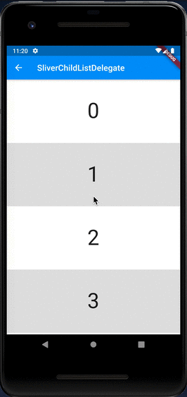
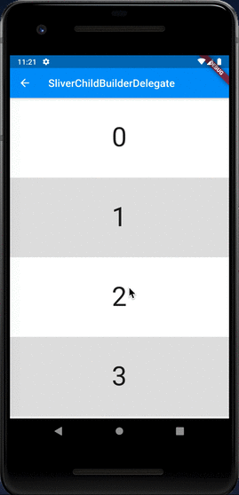
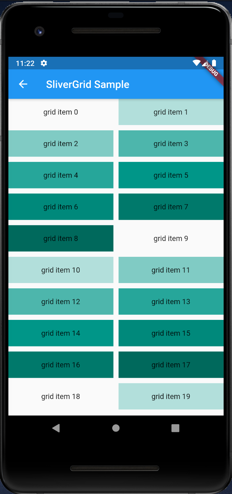

# SliverList & SliverGrid

## Docs

[SliverList class](https://api.flutter.dev/flutter/widgets/SliverList-class.html)

[SliverGrid class](https://api.flutter.dev/flutter/widgets/SliverGrid-class.html)

## Screenshots

|Menu|SliverChildListDelegate|SliverChildBuilderDelegate|
|-|-|-|
||||

|SliverGrid.count()|SliverGrid.extent()|SliverGrid Sample|
|-|-|-|
|crossAxisCount: 4|maxCrossAxisExtent: 90.0|-|
||||
