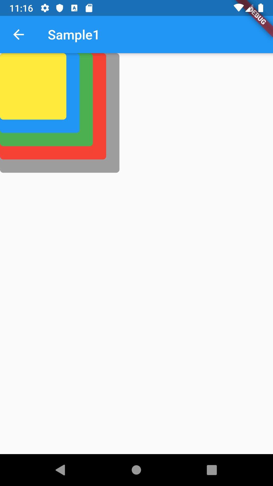
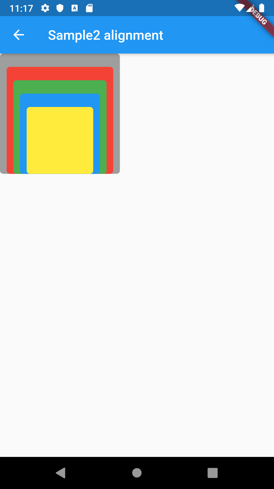
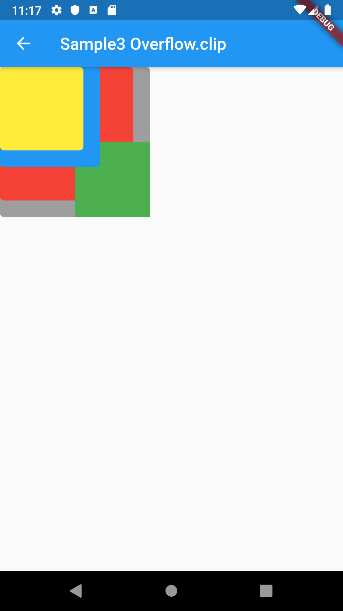
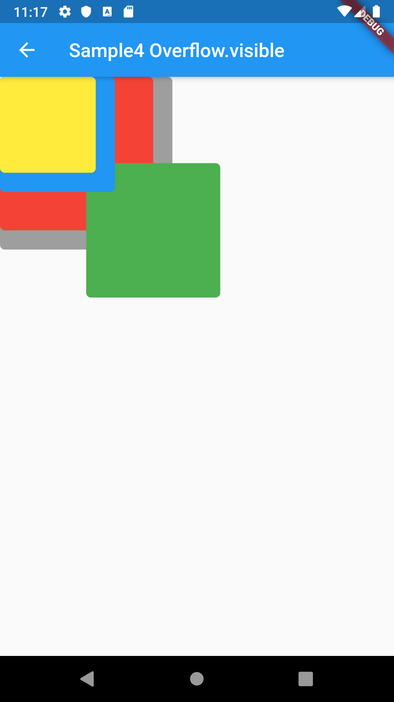
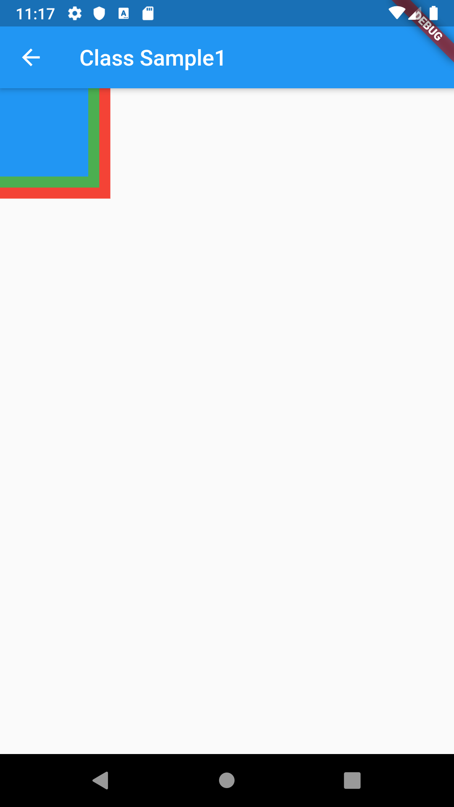
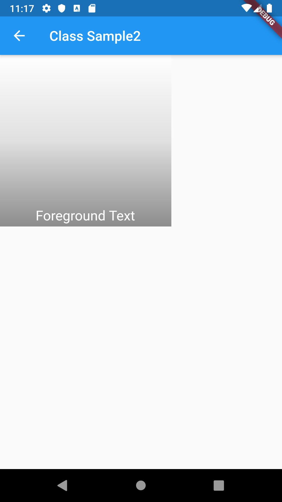

# Stack

## Docs

[Stack class](https://api.flutter.dev/flutter/widgets/Stack-class.html)

## Screenshots

|[Sample1](lib/pages/sample1.dart)|[Sample2](lib/pages/sample2.dart)|
|:-:|:-:|
|||

|[Sample3](lib/pages/sample3.dart)|[Sample4](lib/pages/sample4.dart)|
|:-:|:-:|
|||

|[Class Sample1](lib/pages/class_sample1.dart)|[Class Sample2](lib/pages/class_sample2.dart)|
|:-:|:-:|
|||

