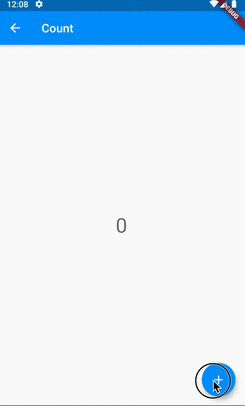
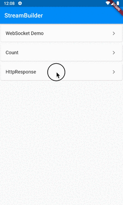

# StreamBuilder

## Docs

[StreamBuilder\<T\> class](https://api.flutter.dev/flutter/widgets/StreamBuilder-class.html)

[Asynchronous programming: streams](https://dart.dev/tutorials/language/streams)

[Cookbook Work with WebSockets](https://flutter.dev/docs/cookbook/networking/web-sockets)

## Screenshots

|[WebSocket Demo](lib/pages/work_with_websocket.dart)|[Count](lib/pages/count.dart)|[HttpResponse](lib/pages/http_response.dart)|
|:-:|:-:|:-:|
|||
