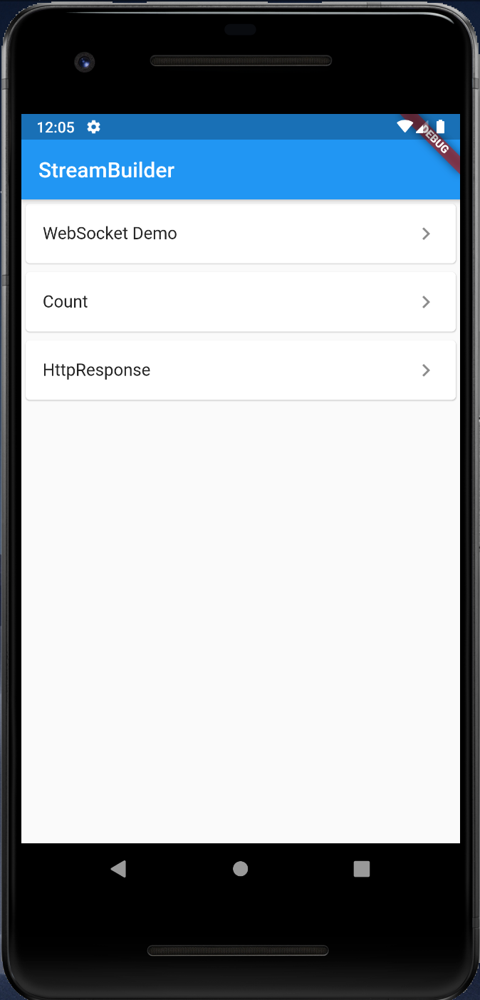

# StreamBuilder

## Docs

[StreamBuilder\<T\> class](https://api.flutter.dev/flutter/widgets/StreamBuilder-class.html)

[Asynchronous programming: streams](https://dart.dev/tutorials/language/streams)

[Cookbook Work with WebSockets](https://flutter.dev/docs/cookbook/networking/web-sockets)

## Screenshots

|Menu|
|-|
||

|WebSocket Demo|Count|HttpResponse|
|-|-|-|
|||