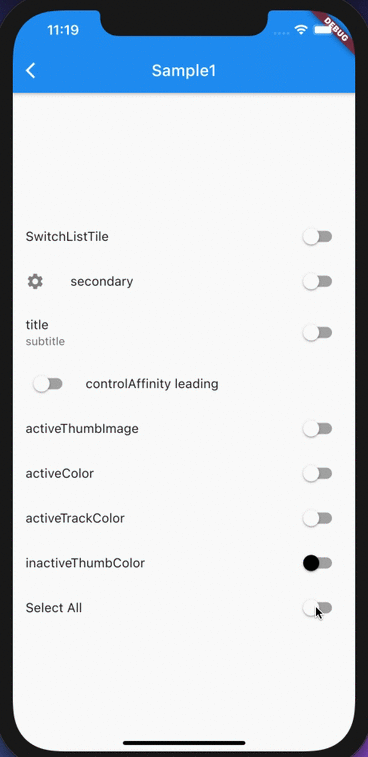

# SwitchListTile

## Docs

[SwitchListTile class](https://api.flutter.dev/flutter/material/SwitchListTile-class.html)

[DartPad](https://dartpad.dev/d01e71905a196a437127022a640ad94b?)  

## Screenshots

|[Sample1](lib/pages/sample1.dart)|
|:-:|
||
