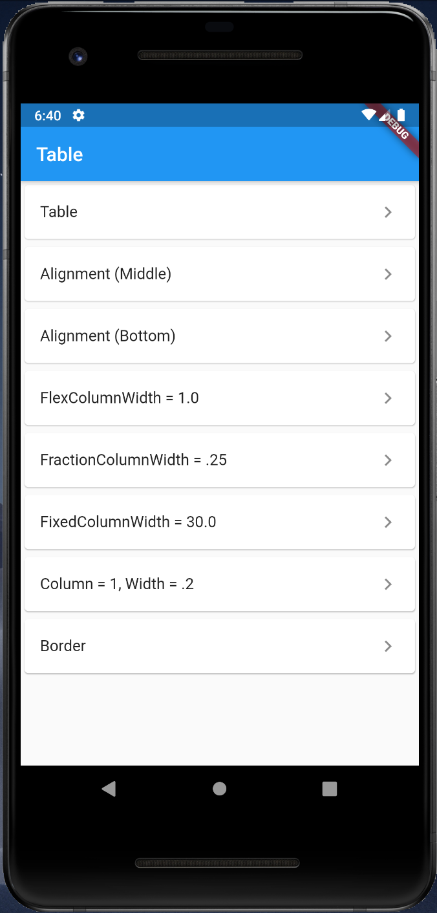
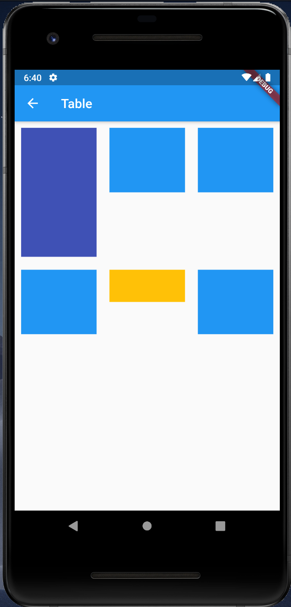
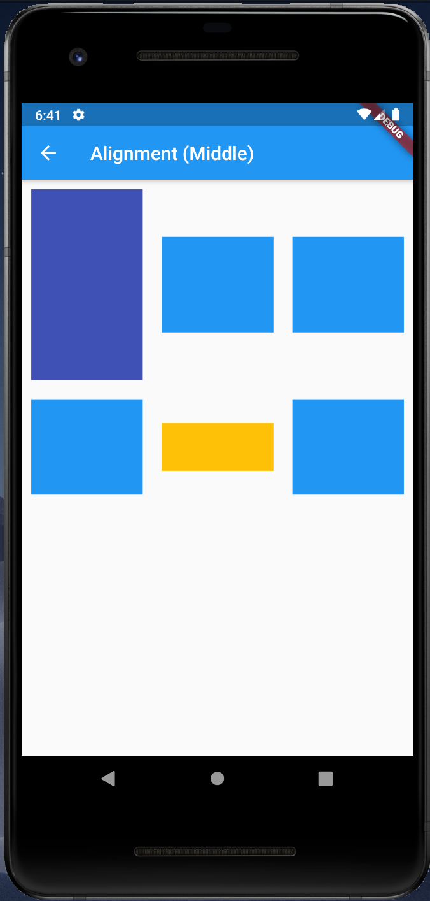
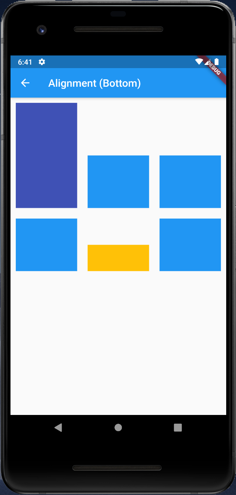
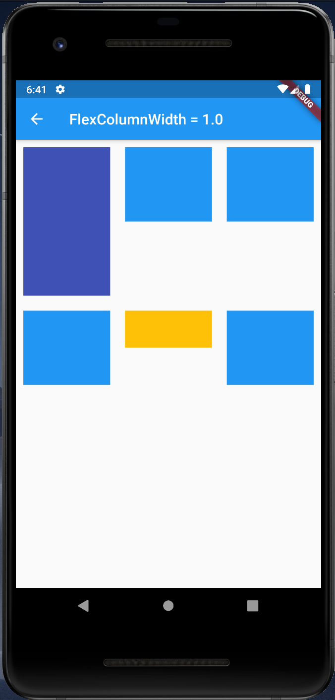
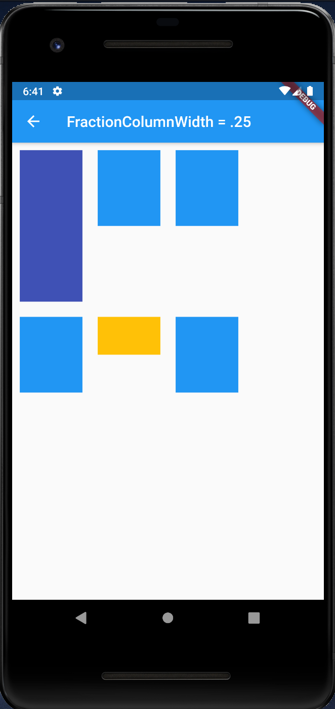
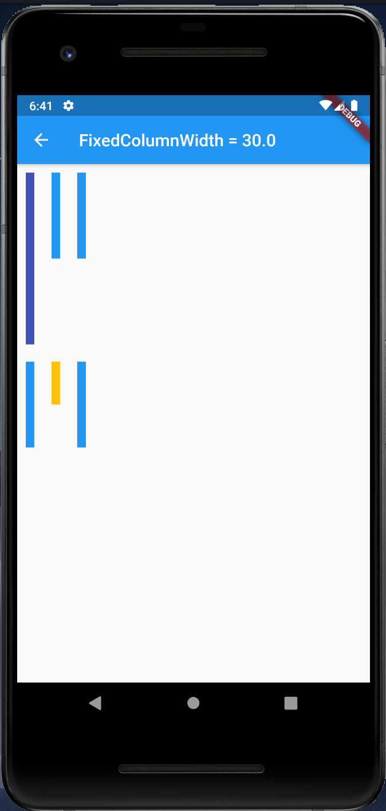
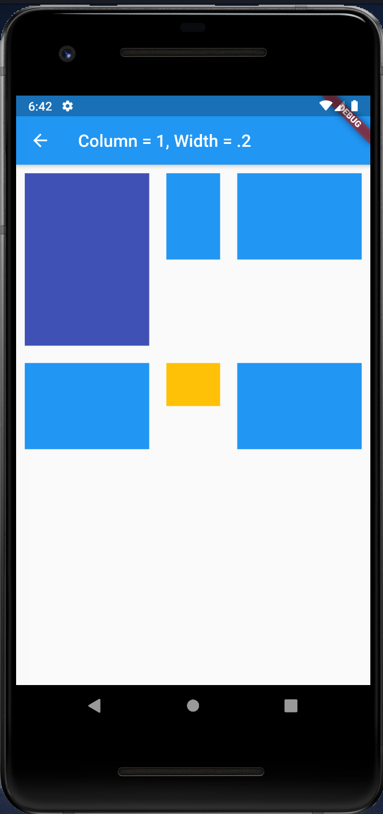
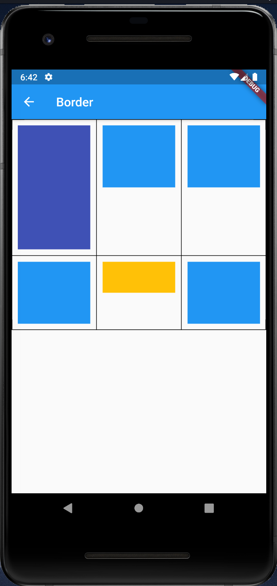

# Table

## Docs

[Table class](https://api.flutter.dev/flutter/widgets/Table-class.html)

## Screenshots

|Menu|Table|Alignment(Middle)|Alignment(Bottom)|
|-|-|-|-|
|||||

|FlexColumnWidth|FractionColumnWidth|FixedColumnWidth|
|-|-|-|
||||

|Column1_Widthdot2|Border|
|-|-|
|||
