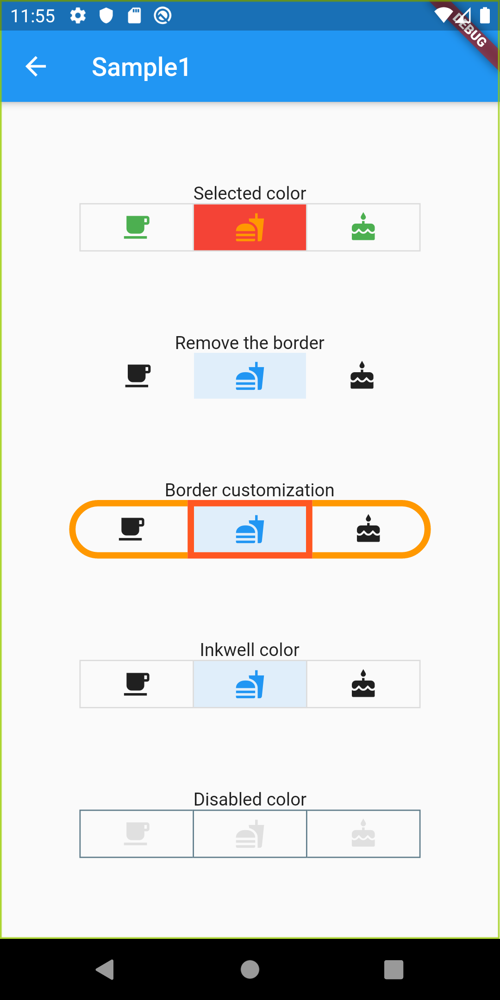
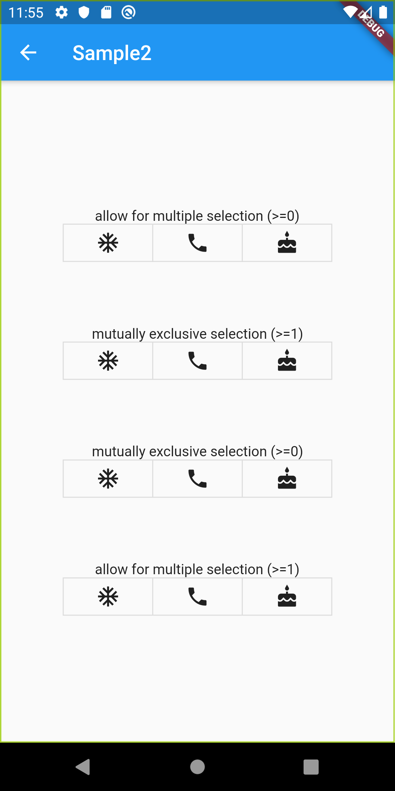

# ToggleButtons

## Docs

[ToggleButtons class](https://api.flutter.dev/flutter/material/ToggleButtons-class.html)

## Screenshots

|[Sample1](./lib/pages/sample1.dart)|[Sample2](./lib/pages/sample2.dart)|
|:-:|:-:|
|||
