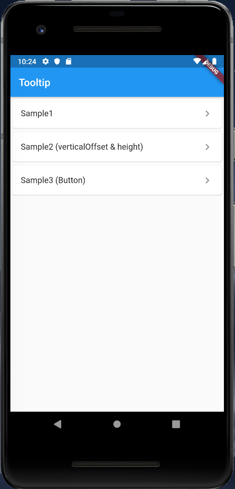
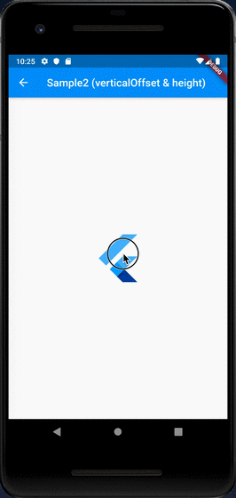
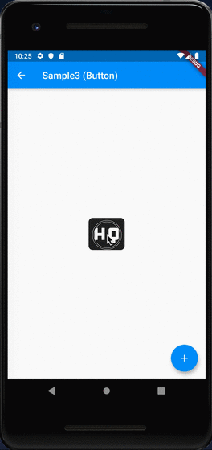

# Tooltip

## Docs

[Tooltip class](https://api.flutter.dev/flutter/material/Tooltip-class.html)

## Screenshots

|Menu|
|-|
||

|Sample1|Sample2 (verticalOffset & height)|Sample3 (Button)|
|-|-|-|
||||
