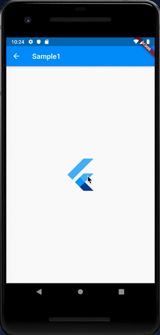

# Tooltip

## Docs

[Tooltip class](https://api.flutter.dev/flutter/material/Tooltip-class.html)

## Screenshots

|[Sample1](lib/pages/sample1.dart)|[Sample2 (verticalOffset & height)](lib/pages/sample2.dart)|[Sample3 (Button)](lib/pages/sample3.dart)|
|:-:|:-:|:-:|
||||
