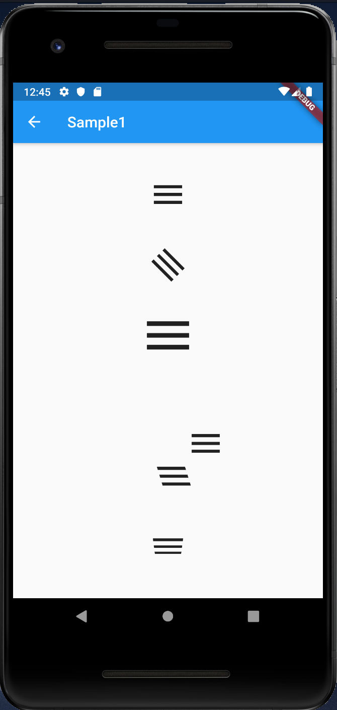
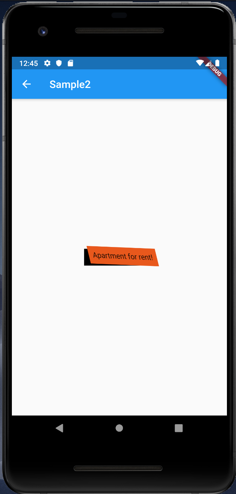

# Transform

## Docs

[Transform class](https://api.flutter.dev/flutter/widgets/Transform-class.html)

[Perspective on Flutter](https://medium.com/flutter/perspective-on-flutter-6f832f4d912e)

[Make 3D flip animation in Flutter](https://medium.com/flutter-community/make-3d-flip-animation-in-flutter-16c006bb3798)

## Screenshots

|[Sample1](lib/pages/sample1.dart)|[Sample2](lib/pages/sample2.dart)|
|:-:|:-:|
|||
