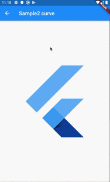
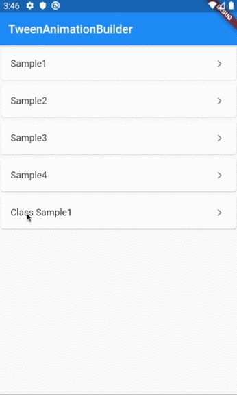

# tween_animation_builder

## Docs

[TweenAnimationBuilder\<T\> class](https://api.flutter.dev/flutter/widgets/TweenAnimationBuilder-class.html)

[Custom Implicit Animations in Flutter…with TweenAnimationBuilder (Medium)](https://medium.com/flutter/custom-implicit-animations-in-flutter-with-tweenanimationbuilder-c76540b47185)

## Screenshots

|[Sample1](./lib/pages/sample1.dart)|[Sample2](./lib/pages/sample2.dart)|[Sample3](./lib/pages/sample3.dart)|
|:-:|:-:|:-:|
||||

|[Sample4](./lib/pages/sample4.dart)|[ClassSample1](./lib/pages/class_sample1.dart)|
|:-:|:-:|
|||
