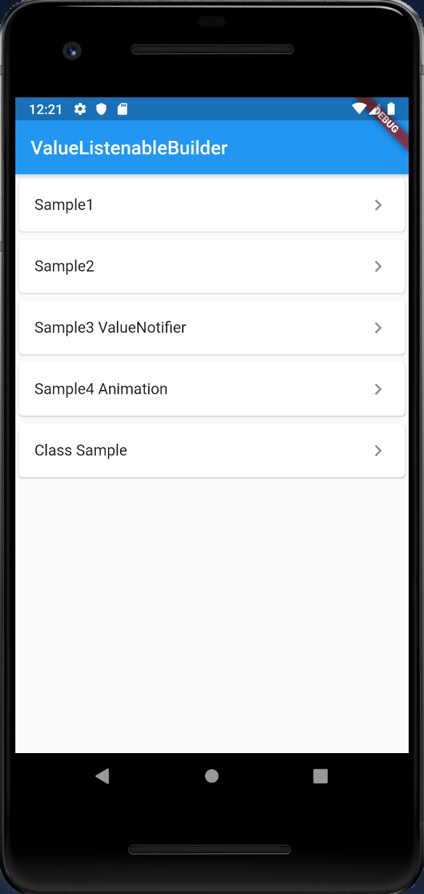
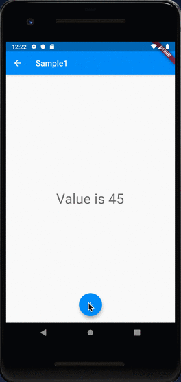
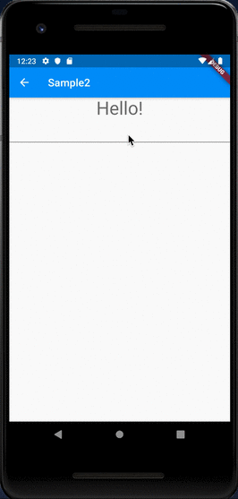
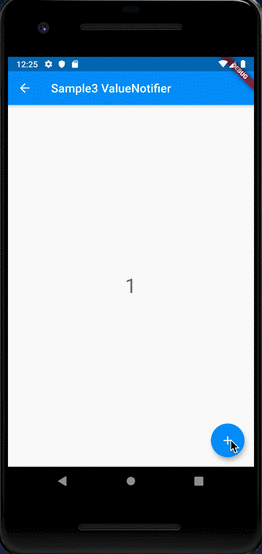
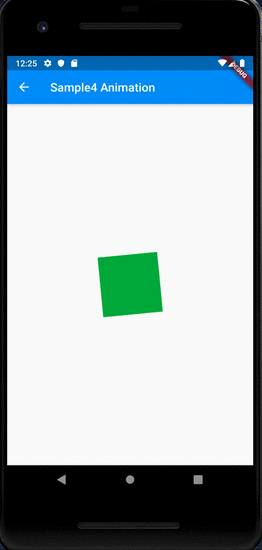
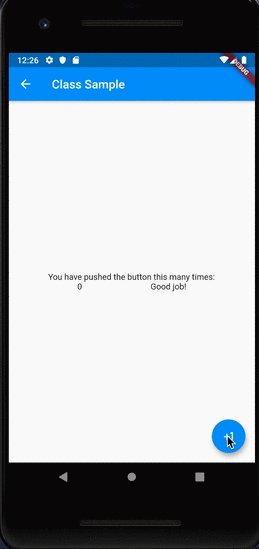

# ValueListenableBuilder

## Docs

[ValueListenableBuilder\<T\> class](https://api.flutter.dev/flutter/widgets/ValueListenableBuilder-class.html)

## Screenshots

|Menu|Sample1|Sample2|
|:-:|:-:|:-:|
||||

|Sample3 ValueNotifier|Sample4 Animation|Class Sample|
|:-:|:-:|:-:|
||||
