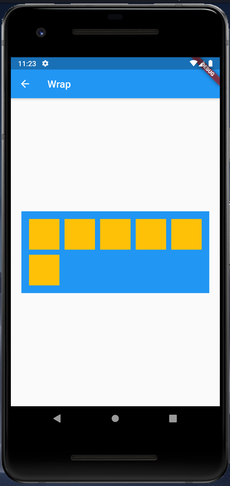

# Wrap

[Wrap class](https://api.flutter.dev/flutter/widgets/Wrap-class.html)

## Screenshots

Menu  

|Not Wrap|Wrap|
| - | - |
|||

|Direction|Alignment_Spacing_runSpasing|
| - | - |
|||

Sample1  
